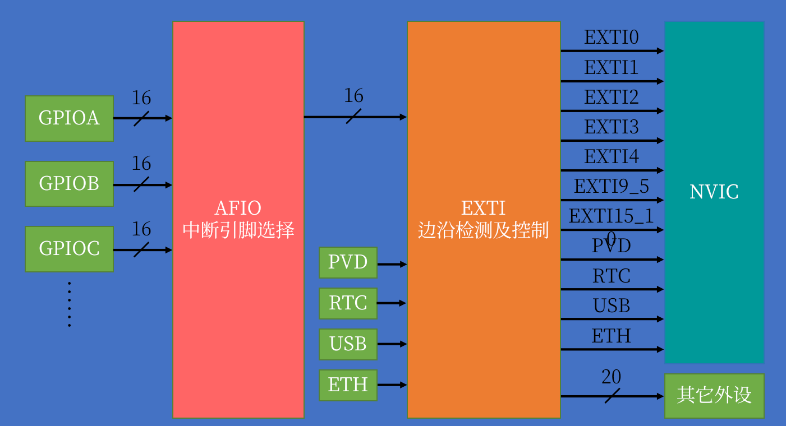

# 名词解释

## STLink

- SWCLK -- SWCLK / JTCK
- SWDIO -- SWDIO / JTMS
- 3.3V -- VCC3.3
- GND -- GND

## JTAG （Joint Test Action Group，联合测试行动小组）

- TMS：测试模式选择，TMS用来设置JTAG接口处于某种特定的测试模式；
- TCK：测试时钟输入；
- TDI：测试数据输入，数据通过TDI引脚输入JTAG接口；
- TDO：测试数据输出，数据通过TDO引 脚从JTAG接口输出；

## SWD （Serial Wire Debug，串行调试）

- 相比于JTAG，只需要4个引脚
- 高速模式更可靠，大数据量JTAG可能会下载程序失败

## OpenOCD (Open On-Chip Debugger)

- 开源的片上调试器
- 需要配合调试仿真器（stlink 、jlink）
- 集成gdb server，因此可以实现gdb在片上的调试
- 集成telnet server，因此可以对目标板进行程序烧录

# Linux下环境搭建

## gcc-arm-none-eabi -- 编译工具链

- 下载 sudo apt install gcc-arm-none-eabi
- apt源下载的可能不是最新，因此使用官网下载https://developer.arm.com/open-source/gnu-toolchain/gnu-rm/downloads
- 官网下载解压后，设置包含到PATH，vi ~/.bashrc, export PATH=$PATH:/home/Lancer/arm-none-eabi-gcc/bin
- https://blog.csdn.net/ybhuangfugui/article/details/98136988
- 使用arm-none-eabi-gcc工具来进行编译，类比于PC环境下的gcc


## stm32标准外设库

- 下载地址https://www.st.com/zh/embedded-software/stm32-standard-peripheral-libraries.html，选取对应系列芯片，此处选F1

- 下载解压出STM32F10x_StdPeriph_Lib_V3.6.0文件夹，重点关注Libraries文件夹

  ```shell
  Lancer@Lancer-PC:~/Documents/Codes/stm32/STM32F10x_StdPeriph_Lib_V3.6.0/Libraries$ tree  -L 2
  .
  ├── CMSIS
  │   ├── CM3 # 启动相关文件，包括内核文件、初始化、启动的汇编文件
  │   ├── CMSIS changes.htm
  │   ├── CMSIS debug support.htm
  │   ├── Documentation
  │   └── License.doc
  └── STM32F10x_StdPeriph_Driver # 官方提供的各种外设API，一般直接把src inc目录所有文件拷贝到自己的工程目录下
      ├── inc
      ├── LICENSE.txt
      ├── Release_Notes.html
      └── src
  
  6 directories, 5 files
  
  ```

  ```shell
  Lancer@Lancer-PC:~/Documents/Codes/stm32/STM32F10x_StdPeriph_Lib_V3.6.0/Libraries/CMSIS/CM3$ tree  
  .
  ├── CoreSupport # 内核文件，需要拷贝到自己创建的工程文件夹中
  │   ├── core_cm3.c
  │   └── core_cm3.h
  └── DeviceSupport
      └── ST
          └── STM32F10x
              ├── LICENSE.txt
              ├── Release_Notes.html
              ├── startup # 启动文件，区分不同环境
              │   ├── arm
              │   ├── gcc_ride7
              │   ├── iar
              │   └── TrueSTUDIO # TrueSTUDIO使用的gcc编译，和当前使用的环境一致，因此需要使用该文件夹下的启动文件
              │       ├── startup_stm32f10x_cl.s
              │       ├── startup_stm32f10x_hd.s # 当前使用的STM32F103ZET6 512K使用这个启动文件
              │       ├── startup_stm32f10x_hd_vl.s
              │       ├── startup_stm32f10x_ld.s
              │       ├── startup_stm32f10x_ld_vl.s
              │       ├── startup_stm32f10x_md.s
              │       ├── startup_stm32f10x_md_vl.s
              │       └── startup_stm32f10x_xl.s
              ├── stm32f10x.h # 总和头文件，需要拷贝到自己工程目录
              ├── system_stm32f10x.c # 系统相关文件，SystemInit函数在其中，需要拷贝到自己工程目录
              └── system_stm32f10x.h
  
  9 directories, 39 files
  
  ```

  

## 工程目录组织

```shell
Lancer@Lancer-PC:~/Documents/Codes/stm32/demo$ tree  -L 2
.
├── Libraries # 标准外设库文件，从STM32F10x_StdPeriph_Lib_V3.6.0/Libraries/STM32F10x_StdPeriph_Driver下拷贝
│   ├── inc
│   └── src
├── Makefile
├── Start # 启动相关文件
│   ├── core_cm3.c # 内核文件，从STM32F10x_StdPeriph_Lib_V3.6.0/Libraries/CMSIS/CM3/CoreSupport拷贝
│   ├── core_cm3.h
│   ├── startup_stm32f10x_hd.s # 启动汇编文件，STM32F10x_StdPeriph_Lib_V3.6.0/Libraries/CMSIS/CM3/DeviceSupport/ST/STM32F10x/startup/TrueSTUDIO中拷贝，当前芯片适用于hd
│   ├── stm32f10x.h
│   ├── system_stm32f10x.c #STM32F10x_StdPeriph_Lib_V3.6.0/Libraries/CMSIS/CM3/DeviceSupport/ST/STM32F10x
│   └── system_stm32f10x.h
├── stm32_flash.ld # 链接脚本，从STM32F10x_StdPeriph_Lib_V3.6.0/Project/STM32F10x_StdPeriph_Template/TrueSTUDIO/STM3210E-EVAL拷贝，注意对应文件夹是STM3210E-EVAL，文件注释描述Linker script for STM32F103ZE Device with512KByte FLASH, 64KByte RAM
└── User # 用户App层文件
    ├── main.c # 定义用户App层函数入口main
    ├── stm32f10x_conf.h # 使用外设标准库的总头文件，main中不需要直接include，只需要include stm32f10x_it.h
    ├── stm32f10x_it.c
    └── stm32f10x_it.h # 在该文件中根据宏USE_STDPERIPH_DRIVER来include stm32f10x_conf.h，因此需要使用标准外设库时，在Makefile中加入编译选项-D USE_STDPERIPH_DRIVER

5 directories, 12 files
```

## Makefile示例

```makefile
# 生成的文件名<项目名>
PROJECT = demo

# 定义文件格式和文件名
TARGET := $(PROJECT)
TARGET_ELF := $(TARGET).elf
TARGET_BIN := $(TARGET).bin
TARGET_HEX := $(TARGET).hex
OBJCPFLAGS_ELF_TO_BIN = -Obinary
OBJCPFLAGS_ELF_TO_HEX = -Oihex
OBJCPFLAGS_BIN_TO_HEX = -Ibinary -Oihex

# 定义路径
TOP_DIR = .
REAL_DIR = $(realpath $(TOP_DIR)) #获取绝对路径，用于openocd烧写
SCRIPT_DIR := $(TOP_DIR)/scripts
STARTUP_DIR := $(TOP_DIR)/Start
INC_DIR := -I$(TOP_DIR)/User -I$(TOP_DIR)/Start -I$(TOP_DIR)/Libraries/inc

# openocd烧写相关路径
OPENOCD_INTER = /usr/share/openocd/scripts/interface/stlink-v2.cfg
OPENOCD_TARGET = /usr/share/openocd/scripts/target/stm32f1x.cfg
FLASH_OFFSET = 0x08000000 # flash偏移量，stm32_flash.ld中指定，在openocd写入hex到flash时偏移

# 设置ld链接脚本文件
LDSCRIPT := $(TOP_DIR)/stm32_flash.ld

# 定义编译工具
CC = arm-none-eabi-gcc
AS = arm-none-eabi-as
LD = arm-none-eabi-ld
AR = arm-none-eabi-ar
OBJCP = arm-none-eabi-objcopy

# 链接文件
LIBS = -lc -lm -lnosys 
LIBDIR = 

# CPU架构，用于编译选项
CPU = -mcpu=cortex-m3
MCU = -mthumb $(CPU)

# .s汇编文件编译选项
ASFLAGS += $(MCU)

# .c文件编译选项
CCFLAGS += $(MCU) -Wall -g -mfloat-abi=soft -march=armv7-m -specs=nosys.specs
CCFLAGS += $(INC_DIR)
CCFLAGS += -D STM32F10X_HD -D USE_STDPERIPH_DRIVER

# 链接选项
LDFLAGS = $(MCU) -specs=nano.specs -T$(LDSCRIPT) $(LIBDIR) $(LIBS) -Wl,-Map=$(TOP_DIR)/$(TARGET).map,--cref -Wl,--gc-sections

# .s汇编启动文件
ASM_SRC += $(STARTUP_DIR)/startup_stm32f10x_hd.s

# .c源文件，即当前目录所有.c文件
C_SRC = $(shell find ./ -name '*.c')

# 替换文件后缀
C_OBJS := $(C_SRC:%.c=%.o)
ASM_OBJS := $(ASM_SRC:%.s=%.o)

# 编译命令的定义
COMPILE = $(CC) $(CCFLAGS) -c $< -o $@ 
ASSEMBLE = $(AS) $(ASFLAGS) -c $< -o $@ 
LINK = $(CC) $+ $(LDFLAGS) $(LDLIBS) -o $@ 
ELF_TO_BIN = $(OBJCP) $(OBJCPFLAGS_ELF_TO_BIN) $< $@
BIN_TO_HEX = $(OBJCP) $(OBJCPFLAGS_BIN_TO_HEX) $< $@ 

# 定义伪目标
.PHONY: all clean printf download

# 定义规则
all: $(TARGET_HEX)
	@echo "build done"

$(TARGET_HEX): $(TARGET_BIN)
	$(BIN_TO_HEX)

$(TARGET_BIN): $(TARGET_ELF)
	$(ELF_TO_BIN)

$(TARGET_ELF): $(C_OBJS) $(ASM_OBJS)
	$(LINK)

$(C_OBJS): %.o:%.c
	$(COMPILE)

$(ASM_OBJS): %.o:%.s
	$(ASSEMBLE) 

printf:
	@echo $(ASM_OBJS)
	@echo $(ASSEMBLE)

# 清理项
clean:
	rm -f $(TARGET_HEX)
	rm -f $(TARGET_BIN)
	rm -f $(TARGET_ELF)
	rm -f $(C_OBJS) $(ASM_OBJS)
	rm -f $(TARGET).map
	@echo "clean done"

# openocd下载
download:
	openocd -f $(OPENOCD_INTER) -f $(OPENOCD_TARGET) -c init -c halt -c "flash write_image erase $(REAL_DIR)/$(TARGET).hex $(FLASH_OFFSET)" -c reset -c shutdown
```


## OpenOCD -- 烧写工具

- 用于烧录程序

- sudo apt-get install openocd

- 安装后脚本目录在/usr/share/openocd/scripts

- 使用方法 https://cloud.tencent.com/developer/article/1662697

  ```shell
  # 1、插入stlink，使用openocd连接
  Lancer@Lancer-PC:~$ openocd -f /usr/share/openocd/scripts/interface/stlink-v2.cfg -f /usr/share/openocd/scripts/target/stm32f1x.cfg  
  Open On-Chip Debugger 0.10.0
  Licensed under GNU GPL v2
  For bug reports, read
          http://openocd.org/doc/doxygen/bugs.html
  Info : auto-selecting first available session transport "hla_swd". To override use 'transport select <transport>'.
  Info : The selected transport took over low-level target control. The results might differ compared to plain JTAG/SWD
  adapter speed: 1000 kHz
  adapter_nsrst_delay: 100
  none separate
  Info : Unable to match requested speed 1000 kHz, using 950 kHz
  Info : Unable to match requested speed 1000 kHz, using 950 kHz
  Info : clock speed 950 kHz
  Info : STLINK v2 JTAG v29 API v2 SWIM v7 VID 0x0483 PID 0x3748
  Info : using stlink api v2
  Info : Target voltage: 3.304043
  Info : stm32f1x.cpu: hardware has 6 breakpoints, 4 watchpoints
  Info : accepting 'telnet' connection on tcp/4444
  
  
  # 2、另外开启一个terminal, 使用telnet 登录到openocd开放的4444端口
  Lancer@Lancer-PC:~$ telnet localhost 4444
  Trying ::1...
  Trying 127.0.0.1...
  Connected to localhost.
  Escape character is '^]'.
  Open On-Chip Debugger
  
  # 3、halt命令，停止目标机运行
  > halt 
  target halted due to debug-request, current mode: Handler HardFault
  xPSR: 0x01000003 pc: 0xfffffffe msp: 0xffffffdc
  
  # 4、falsh write_image erase xxx把xx文件下载到目标机中
  > flash write_image erase /home/Lancer/Template.hex 
  auto erase enabled
  device id = 0x10016414
  flash size = 512kbytes
  target halted due to breakpoint, current mode: Handler HardFault
  xPSR: 0x61000003 pc: 0x2000003a msp: 0xffffffdc
  wrote 2048 bytes from file /home/Lancer/Template.hex in 0.155276s (12.880 KiB/s)
  
  # 5、reset 复位目标机，复位之后下载的程序即会运行
  > reset
  
  # 6、ctrl + ] 退出telnet终端
  ```
  
  ​	
  
  ```shell
  # 也可以直接使用openocd -c 参数下发命令，一键下载
  openocd -f /usr/share/openocd/scripts/interface/stlink-v2.cfg -f /usr/share/openocd/scripts/target/stm32f1x.cfg -c init -c halt -c "flash write_image erase /home/Lancer/Template.hex" -c reset -c shutdown
  # 注意flash write_image erase带引号
  # 可以考虑将上述命令写入makefile，可以直接make download一键下载
  ```

# GPIO

- 所有GPIO，A～G都挂接在APB2上，因此使用前需要初始化APB2外设时钟 

  ```c
  RCC_APB2PeriphClockCmd(RCC_APB2Periph_GPIOx, ENABLE);
  ```

- GPIO_InitTypeDef结构体进行GPIO口配置

  ```c
  GPIO_InitTypeDef gpioTypefDef;
  gpioTypefDef.GPIO_Pin = GPIO_Pin_5 | GPIO_Pin_4;
  gpioTypefDef.GPIO_Speed = GPIO_Speed_50MHz;
  gpioTypefDef.GPIO_Mode = GPIO_Mode_Out_PP; // Push Pull推挽输出
  
  GPIO_Init(GPIOB, &gpioTypefDef);
  ```

- 输出

  ```c
  void GPIO_SetBits(GPIO_TypeDef* GPIOx, uint16_t GPIO_Pin);
  void GPIO_ResetBits(GPIO_TypeDef* GPIOx, uint16_t GPIO_Pin);
  ```

- 输入

  ```c
  uint8_t GPIO_ReadInputDataBit(GPIO_TypeDef* GPIOx, uint16_t GPIO_Pin);
  uint16_t GPIO_ReadInputData(GPIO_TypeDef* GPIOx);
  uint8_t GPIO_ReadOutputDataBit(GPIO_TypeDef* GPIOx, uint16_t GPIO_Pin);
  uint16_t GPIO_ReadOutputData(GPIO_TypeDef* GPIOx);
  ```

  

| IO模式       | 性质     | 特征                                               | 备注                                                         |
| ------------ | -------- | :------------------------------------------------- | ------------------------------------------------------------ |
| 浮空输入     | 数字输入 | 如果引脚悬空，则高低电平不确定                     | 由于悬空不确定，因此使用时一般需要外接驱动电路，比如外接下拉电阻 |
| 上拉输入     | 数字输入 | 如果引脚悬空，由于内部上拉电阻，默认高电平         | 用作按键输入时，配合电路按键接GND                            |
| 下拉输入     | 数字输入 | 如果引脚悬空，由于内部下拉电阻，默认低电平         |                                                              |
| 模拟输入     | 模拟输入 | GPIO无效，引脚直接接入内部ADC                      | 用于ADC                                                      |
| 开漏输出     | 数字输出 | 高电平是高阻态，没有驱动能力，低电平接入VSS        | 高点平                                                       |
| 推挽输出     | 数字输出 | 高电平VDD，低电平VSS                               | 一般数字输出常用推挽输出模式                                 |
| 复用开漏输出 | 数字输出 | 区别于开漏输出，复用开漏输出高低电平由片上外设控制 |                                                              |
| 复用推挽输出 | 数字输出 | 区别于推挽输出，复用推挽输出高低电平由片上外设控制 |                                                              |

# 中断

- 最多68个中断通道，包含EXTI外部中断、TIM时钟中断、ADC、USART串口中断、SPI、I2C、RTC实时时钟中断
- 使用NVIC嵌套向量中断控制器对中断进行控制，NVIC是内核外设，连接到CPU接口，用于集中控制管理中断信号，从而不需要CPU对中断进行直接控制而影响CPU执行效率
- 对于每个通道，使用优先级寄存器的4位表示，共同16个可编程的优先级，0优先级最高。4位中高n位表示抢占优先级，低4 - n位表示响应优先级
- 抢占优先级高可以进行中断嵌套，响应优先级高可以优先排队，对于二者都相同的中断，按照中断号排队，中断号参考中断向量表

## EXTI(External Interrupt)外部中断

- 可以监测GPIO口的电平变化，变化后向NVIC发出中断请求，NVIC裁决后触发CPU中断

- 支持所有GPIO 口，但是相同的Pin不可以同时触发，例如GPIOA_Pin2 、GPIOG_Pin_2，原因在于所有GPIO口先是通过AFIO中断引脚选择器之后再接入EXTI外部中断控制器，而相同的Pin实际在AFIO中共享一条线路

  

- EXTI支持上升沿、下降沿、双边沿、软件（即使硬件电平不变化，跑到对应的软件代码也可以触发）触发方式

- 响应方式除了常规的CPU跳转执行中断程序的中断响应外，还可以是事件响应，即直接触发一个事件，让其他外设完成响应的工作，如ADC等。个人理解设计初衷在于，不需要在CPU中断程序中手动调用其他外设完成相应的事件，而是直接使用硬件电路完成对其他外设的调用，便于开发以及获得更优的执行效率

- 按键监测不建议直接使用EXTI，因为无法处理抖动。建议使用定时器中断读取

- EXTI通道除了包含GPIO外，还包含PVD、RTC闹钟、USB唤醒、ETH唤醒中断，用于唤醒STM32

  ```c
  /****************************************************************************************************
  初始化流程，从上图可知整体流程经过GPIO、AFIO、EXTI、NVIC，因此初始化流程也会涉及上述几个模块
  ****************************************************************************************************/
  // GPIO，假设使用GPIOB_Pin_14
  RCC_APB2PeriphClockCmd(RCC_APB2Periph_GPIOB, ENABLE); // 使能ABP2的时钟，因为GPIO挂接在APB2总线上
  GPIO_InitTypeDef GPIO_InitStructure;
  GPIO_InitStructure.GPIO_Mode = GPIO_Mode_IPU;
  GPIO_InitStructure.GPIO_Pin = GPIO_Pin_14;
  GPIO_InitStructure.GPIO_Speed = GPIO_Speed_50MHz;
  GPIO_Init(GPIOB, &GPIO_InitStructure);
  
  // AFIO，数据选择器控制哪一路GPIO引脚到达EXTI
  RCC_APB2PeriphClockCmd(RCC_APB2Periph_AFIO, ENABLE); // AFIO同样挂接在ABP2总线，同样需要使能时钟
  GPIO_EXTILineConfig(GPIO_PortSourceGPIOB, GPIO_PinSource14); // 配置AFIO数据选择器，此处配置GPIOB14为中断源
  
  // EXTI
  EXTI_InitTypeDef EXTI_InitStructure;
  EXTI_InitStructure.EXTI_Line = EXTI_Line14;
  EXTI_InitStructure.EXTI_LineCmd = ENABLE;
  EXTI_InitStructure.EXTI_Mode = EXTI_Mode_Interrupt; // 中断响应，可选EXTI_Mode_Event事件响应
  EXTI_InitStructure.EXTI_Trigger = EXTI_Trigger_Falling; // 下降沿触发
  EXTI_Init(&EXTI_InitStructure);EXTI(External Interrupt)外部中断
  
  // NVIC
  NVIC_PriorityGroupConfig(NVIC_PriorityGroup_2); // 中断分组，即上述的抢占优先级和响应优先级，根据4bit分组，此处使用NVIC_PriorityGroup2,即2bit用于抢占优先级，剩下2bit用于响应优先级，此时两种优先级都是0-3总共4级。
  // 且注意整个芯片中的NVIC分组方式只能使用一种，因此一般该函数只会调用一次，不应该放入某个模块的初始化中，避免多次调用传参分组方式不一致的情况
  
  NVIC_InitTypeDef NVIC_InitStructure;
  NVIC_InitStructure.NVIC_IRQChannel = EXTI15_10_IRQn; // 中断通道，EXTI10-15共用一个中断通道
  NVIC_InitStructure.NVIC_IRQChannelCmd = ENABLE; // 使能中断通道
  NVIC_InitStructure.NVIC_IRQChannelPreemptionPriority = 1; // preemption抢占优先级，注意优先级分组，由于选择了NVIC_PriorityGroup_2，两种优先级范围都是0-3
  NVIC_InitStructure.NVIC_IRQChannelSubPriority = 1; // subpriority响应优先级
  NVIC_Init(&NVIC_InitStructure);
  
  ```

  ```c
  /****************************************************************************************************中断处理函数，在startup_stm32f10x_hd.s启动文件中，写明了中断向量表，找到对应EXTI中断通道的函数名，实现该函数，由于此处用了GPIOB_Pin_14，10-15Pin共用一个中断通道，函数是EXTI15_10_IRQHandler
  ****************************************************************************************************/
  // 中断处理固定格式，void参数，返回值void
  void EXTI15_10_IRQHandler(void)
  {
      // 由于10-15共用中断通道，进入中断后需要判断一下触发中断是哪一路信号，通过中断标记位判断
      if (EXTI_GetITStatus(EXTI_Line14) == SET)
  	{
          /* do something 进行业务对应的中断处理*/
          
  		EXTI_ClearITPendingBit(EXTI_Line14); // 处理完后清除中断标记位，否则一直触发中断
  	}
  }
  ```

